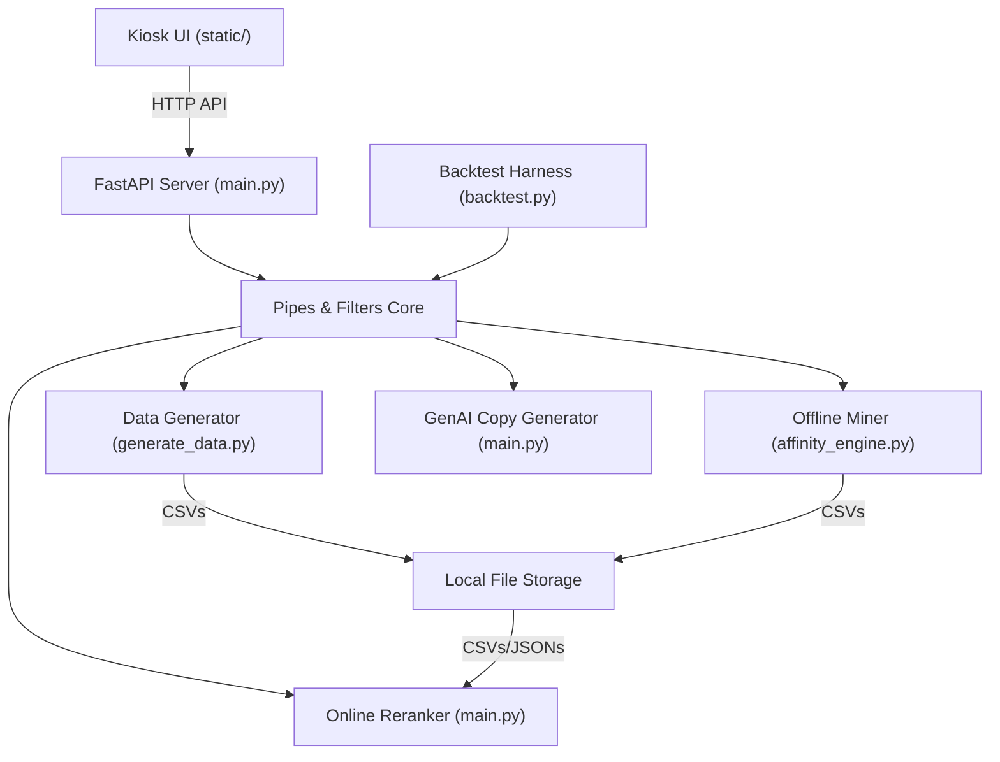

# Architecture Spine — KFC Kiosk Recommendation System

## Design Paradigm

The codebase follows a hybrid **Pipes and Filters** design pattern for the recommendation and simulation flows, wrapped within a standard **Layered** layout for web endpoints and frontend assets. Each stage in the pipeline has distinct, isolated boundaries that process incoming data envelopes and pass them to the next stage.



---

## Invariants & Rules

### AD-1 — Pipes & Filters Architecture
- **Binds:** `all`
- **Prevents:** Tightly coupled components where recommendation logic is mixed directly into UI routes or file parsers.
- **Rule:** The recommendation logic core must be implemented as modular filters with clear data contracts. The web server (`main.py`) acts only as a driver/delivery layer, depending on the pipeline but exposing no internal processing logic.

### AD-2 — Storage & Memory State
- **Binds:** `CAP-1`, `CAP-2`, `CAP-3`
- **Prevents:** Database dependency overhead and latency bottlenecks during live hackathon demos.
- **Rule:** Product catalog (`menu.csv`), promotions (`promotions.csv`), and association rules (`affinity_rules.json`) must be read from local files under `_bmad-output/data/` and cached in-memory at backend startup.

### AD-3 — GenAI Response Latency & Offline Resilience
- **Binds:** `CAP-4`
- **Prevents:** Kiosk UI freezes, API timeouts, or demo failures due to network latency or venue Wi-Fi drops.
- **Rule:** The system must generate copies using exactly one API call per recommendation event. The prompt must request structured JSON. If the Gemini API call fails or exceeds a `1.2s` timeout threshold, the system must immediately fall back to a local, rule-based template generator (e.g., `"Complete your meal! Add [item] for only [price]đ"`).

### AD-4 — Reranking Scoring Formula
- **Binds:** `CAP-3`
- **Prevents:** Arbitrary or black-box recommendation logic that cannot be mathematically explained to hackathon judges.
- **Rule:** Mined affinity confidence scores must be adjusted in real-time using a multiplicative scoring model:
  Score = Base_Confidence * (1 + Promo_Boost) * (1 + Time_Boost)
  where Promo_Boost is the active promotion boost (+0.20) and Time_Boost is the time-of-day category boost (+0.15).

### AD-5 — API Interfaces
- **Binds:** `CAP-3`, `CAP-4`, `CAP-5`, `CAP-6`
- **Prevents:** Contract mismatches between the single-page frontend and the FastAPI server.
- **Rule:** The backend must expose:
  1. `POST /api/recommend`: Accepts cart items and a timestamp; returns a list of recommended item names, prices, confidence scores, GenAI rationales, and customized copy.
  2. `POST /api/backtest`: Replays historical order data to compare AOV uplift, returning baseline AOV, hybrid AOV, absolute change, and percentage uplift.

### AD-6 — Directory Structure
- **Binds:** `all`
- **Prevents:** Codebase layout drift.
- **Rule:** All new backend files must reside in the project root. All frontend UI files (HTML, CSS, JS) must reside inside a dedicated `static/` directory.

---

## Consistency Conventions

| Concern | Convention |
| --- | --- |
| Naming (entities, files, interfaces, events) | Python functions and files use `snake_case`. Frontend JavaScript uses `camelCase`. REST API endpoints use `/api/` prefix. |
| Data & formats (ids, dates, error shapes, envelopes) | Timestamps in ISO 8601 format. Prices represented in Vietnamese Dong (VND). Errors wrapped in a standard `{"detail": "..."}` JSON envelope. |
| State & cross-cutting (mutation, errors, logging, config, auth) | Backend recommendation pipeline must be entirely stateless. Errors logged to standard output (`stdout`). Config parameters (like Gemini API keys) read from environment variables. |

---

## Stack

| Name | Version |
| --- | --- |
| Python | 3.12 |
| FastAPI | latest |
| pandas | latest |
| mlxtend | latest |
| SQLite | 3 (Local database store) |
| HTML/JS/CSS | Vanilla (Premium aesthetics, Outfit/Inter typography, vibrant gradients, micro-animations) |
| Gemini API | gemini-2.5-flash |

---

## Structural Seed

```text
{root}/
  generate_data.py        # Generates menu.csv, promotions.csv, and orders.csv (Existing)
  affinity_engine.py      # Mines rules and outputs affinity_rules.json (Existing)
  init_db.py              # SQLite database initialization (New)
  backtest.py             # Replays synthetic orders for AOV calculation (New)
  main.py                 # FastAPI backend app, endpoint routing (New)
  static/                 # Kiosk UI folder (New)
    index.html            # Simulated KFC kiosk terminal page
    style.css             # Vibrant modern styling
    app.js                # Frontend API calls and live panels
  _bmad-output/
    data/                 # Mined rules, generated catalog CSVs, and kiosk.db (Updated)
```

---

## Capability → Architecture Map

| Capability / Area | Lives in | Governed by |
| --- | --- | --- |
| CAP-1: Data Generation | `generate_data.py` | AD-2, AD-6 |
| CAP-2: Offline Affinity Mining | `affinity_engine.py` | AD-2, AD-6 |
| CAP-3: Online Context Reranker | `main.py` | AD-1, AD-4, AD-5 |
| CAP-4: GenAI personalized copy | `main.py` | AD-1, AD-3, AD-5 |
| CAP-5: Kiosk UI | `static/` | AD-5, AD-6 |
| CAP-6: Backtest Harness | `backtest.py` | AD-1, AD-5, AD-6 |

---

## Deferred

* **Ollama Local LLM Support**: Implement local Llama 3.2 Ollama driver as an alternative LLM provider to ensure 100% offline demonstration capability if internet speed test fails.
* **Reranker Scoring Optimization**: Tune and evaluate alternative scoring formula variations (e.g., incorporating Lift metrics, linear scoring models) during backtesting iterations.
