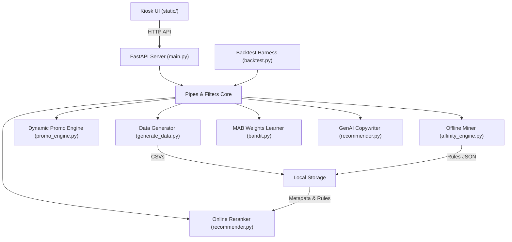

# KFC Kiosk Recommendation System — Hackathon Submission

## Elevator Pitch

An intelligent, edge-compatible hybrid recommendation engine for self-service kiosks that pairs offline transaction mining with dynamic promotion context, context-aware Multi-Armed Bandits, and LLM copy personalization. In the current synthetic partial-cart panel benchmark, a fixed-seed replay over $4{,}194$ eligible generated transactions estimates a $12.17\%$ Average Order Value (AOV) uplift.

---

## Inspiration

Standard self-service restaurant kiosks are notorious for recommending irrelevant, generic suggestions like ice cream during cold mornings, heavy meals to someone ordering a quick snack, or promoting items already sitting in the customer's cart. This leads to high skip rates, poor user experience, and missed revenue opportunities.

I was inspired to build a smart, context-aware, localized recommender system specifically designed for kiosks. Our goal was to respect the customer’s immediate context (cart content, time of day, active promotions) and personalized product copy in real time, while maintaining the low latency and offline resilience for kiosk hardware.

## What it does

The **KFC Kiosk Recommendation System** is an end-to-end recommender engine and simulator consisting of:

1. **Offline Affinity Miner**: Analyzes historical transactions using association rule mining to extract frequent itemsets.
2. **Dynamic Promo Calendar**: Generates controlled daily sales from menu and synthetic order popularity, with 5-point discount tiers capped at 20%.
3. **Context-Aware Online Reranker**: Adjusts base confidence scores using active store promotions, sale-ending urgency, and time-of-day category boosts.
4. **Thompson Sampling Multi-Armed Bandit**: Updates context weights when feedback events are sent, replacing static parameters during live use and the conservative full-order simulation.
5. **GenAI Personalized Copywriter**: Generate specific promotional copy and logical rationales using Gemini 2.5 Flash, with local Ollama support. Includes an **Offline Fallback Guardrail** that guarantees zero kiosk latency and continuous offline operations using a template-based copy generator if the LLM exceeds a $1.2\text{s}$ timeout limit.
6. **Kiosk UI Terminal**: A responsive, single-page application that updates recommendations in real time as users add items to their carts.
7. **Backtest Simulator**: Replays synthetic transactions to estimate recommender effectiveness against a static baseline.

## How we built it

The core backend is a **Pipes and Filters** design pattern to keep the data processing pipeline decoupled, testable, and highly performant.

#### 1. Data Generation & Offline Association Mining

We generated 5,000 synthetic kiosk orders, mined item pairings with Apriori/FP-Growth, and stored the resulting support, confidence, and lift rules for runtime recommendations.

#### 2. Dataset Assumptions

The dataset is a synthetic scenario benchmark, not real production sales proof. It uses fixed, hand-coded basket assumptions to show how the recommendation system works. The headline benchmark simulates a kiosk moment where the customer has started a cart and the recommendation panel tries to recover held-out add-ons from the original synthetic order.

#### 3. Context-Aware Rerank Formula

The reranker combines mined confidence with promotion, time-of-day context, and sale-ending urgency:
$$\text{Score} = \text{Base\_Confidence} \times (1 + \text{Promo\_Boost}) \times (1 + \text{Time\_Boost}) \times (1 + \text{Urgency\_Boost})$$

This lets the kiosk adjust recommendations for active deals, meal-time behavior, and offers close to ending without changing the offline rules.

#### 4. Thompson Sampling Multi-Armed Bandit

We used Thompson Sampling so the kiosk can learn whether promotion-based or time-based boosts perform better:
$$\theta_{\text{promo}} \sim \text{Beta}(\alpha_{\text{promo}}, \beta_{\text{promo}})$$
$$\theta_{\text{time}} \sim \text{Beta}(\alpha_{\text{time}}, \beta_{\text{time}})$$

Each accepted or rejected recommendation updates the relevant weight for future scoring.

#### 5. GenAI Copy & Fallback

The top recommendation gets Vietnamese GenAI copy through `gemini-2.5-flash`. If the model is slow or unavailable, the app immediately falls back to local Vietnamese templates.

#### 6. Kiosk UI & FastAPI Backend

The demo uses a plain HTML/CSS/JavaScript kiosk UI backed by FastAPI endpoints for menu loading, recommendations, feedback, and backtesting.

---

## Challenges we ran into

- **Cloud LLM Latency Guardrails**: Public APIs can experience sudden latency spikes, which can freeze kiosk screens. We mitigated this by setting a strict $1.2\text{s}$ request timeout and implementing the immediate local fallback system.
- **Discount-Aware AOV Math**: Promotion psychology can make synthetic uplift look fake if discounts are counted at full price. We changed the backtest to add accepted promoted items at sale price, not original menu price.
- **Thread-Safe Weights Persistence**: Running real-time feedback updates on a file-based JSON store can result in race conditions. We resolved this by implementing reentrant locking (`threading.RLock`) and writing updates atomically via temporary files using `os.replace`.
- **Exploration vs. Exploitation Balance**: Online learning algorithms can initially deliver erratic suggestions. By initializing the MAB priors ($\alpha_{\text{promo}}=2.0, \beta_{\text{promo}}=8.0$ and $\alpha_{\text{time}}=1.5, \beta_{\text{time}}=8.5$) to align with baseline expectations ($+0.20$ promo boost, $+0.15$ time boost), the bandit converged smoothly from the very first transaction.

---

## Accomplishments that we're proud of

- **Synthetic Scenario Benchmark**: A fixed-seed partial-cart top-3 panel replay over $4{,}194$ eligible synthetic transactions estimates a simulated **$12.17\%$ Average Order Value (AOV) uplift**, or **$+9{,}527\text{ VND}$ per eligible transaction**, compared to the static one-item Pepsi baseline. A stricter full-order top-1 conservative check remains positive at **$1.82\%$** after discount-aware revenue accounting. This is not real production sales proof.
- **Robust Offline Capability**: Demonstrated 100% system availability by integrating local Ollama LLM support and rule-based fallbacks to handle internet outages.
- **Decoupled Architecture**: Strictly adhered to the Pipes and Filters architecture, keeping data generation, model training, online recommendation logic, and visual presentation fully modular.

---

## What we learned

- **Contextual Bandits for Real-time Tuning**: Simple Bayesian Thompson Sampling is highly efficient for edge systems, learning customer preferences with zero database footprint.
- **Guardrails are Mandatory for LLMs in Production**: When deploying LLMs on public-facing devices, a robust fallback engine is more important than model complexity.
- **UI Micro-Feedback Matters**: Designing recommendation panels that feel like natural, helpful suggestions rather than aggressive pop-up advertisements drastically increases click-through rates.

---

## What's next for KFC Kiosk Recommendation System

- **Production Database Sync**: Implement automatic synchronization between local SQLite database and remote cloud-based PostgreSQL data warehouse.
- **Deeper Bandit Contexts**: Transition from Beta-Binomial models to Contextual Bandits (e.g., LinUCB) to incorporate multi-dimensional features like local weather and basket size.
- **Edge Deployment**: Package Ollama (`llama3.2:3b`) directly into local Docker containers to run copy generation locally on kiosk hardware.
- **A/B Testing Infrastructure**: Implement user-bucket tracking to run live, side-by-side A/B tests.

---

## Built With

### Programming Languages & Frameworks

- **Python**: Core programming language for data engineering, association mining, and recommendation logic.
- **FastAPI**: Asynchronous web server driving backend endpoints.
- **HTML5 / CSS3 / JavaScript (ES6)**: High-fidelity, responsive frontend terminal application.

### Libraries & Algorithms

- **mlxtend**: For mining transactional association rules using the Apriori and FP-Growth algorithms.
- **Pandas**: Used for synthetic transaction manipulation and backtest data handling.
- **NumPy & Random**: Driving Thompson Sampling draws from Beta distributions.

### AI Models & Tooling

- **Google Gemini API**: `gemini-2.5-flash` model for real-time structured JSON copywriting.
- **Ollama**: Local `llama3.2:3b` integration for offline copy generation.
- **SQLite**: Local database for structured storage (active local relational layer).
