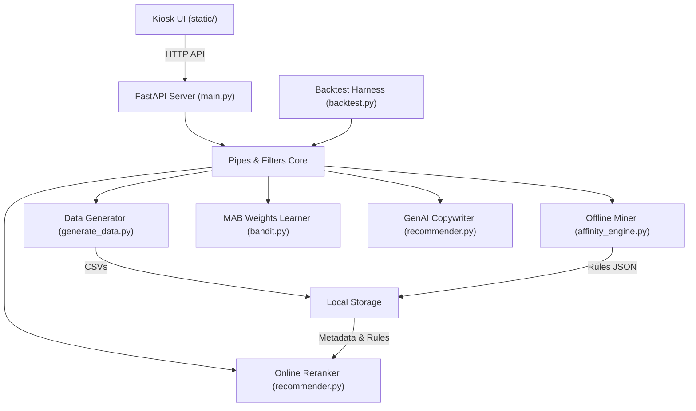

# KFC Kiosk Recommendation System — Hackathon Submission

## Elevator Pitch

An intelligent, edge-compatible hybrid recommendation engine for self-service kiosks that pairs offline transaction mining with real-time, context-aware Multi-Armed Bandits and LLM copy personalization to deliver a mathematically validated $5.83\%$ Average Order Value (AOV) uplift.

---

## Inspiration

Standard self-service restaurant kiosks are notorious for recommending irrelevant, generic suggestions like ice cream during cold mornings, heavy meals to someone ordering a quick snack, or promoting items already sitting in the customer's cart. This leads to high skip rates, poor user experience, and missed revenue opportunities.

I was inspired to build a smart, context-aware, localized recommender system specifically designed for kiosks. Our goal was to respect the customer’s immediate context (cart content, time of day, active promotions) and personalized product copy in real time, while maintaining the low latency and offline resilience for kiosk hardware.

## What it does

The **KFC Kiosk Recommendation System** is an end-to-end recommender engine and simulator consisting of:

1. **Offline Affinity Miner**: Analyzes historical transactions using association rule mining to extract frequent itemsets.
2. **Context-Aware Online Reranker**: Adjusts base confidence scores using active store promotions and time-of-day category boosts.
3. **Thompson Sampling Multi-Armed Bandit**: Dynamically learns optimal context weights in real time based on customer interaction feedback, replacing static parameters.
4. **GenAI Personalized Copywriter**: Generate specific promotional copy and logical rationales using Gemini 2.5 Flash, with local Ollama support. Includes an **Offline Fallback Guardrail** that guarantees zero kiosk latency and continuous offline operations using a template-based copy generator if the LLM exceeds a $1.2\text{s}$ timeout limit.
5. **Kiosk UI Terminal**: A responsive, single-page application that updates recommendations in real time as users add items to their carts.
6. **Backtest Simulator**: Replays historical transactions to mathematically validate recommender effectiveness against a static baseline.

## How we built it

The core backend is a **Pipes and Filters** design pattern to keep the data processing pipeline decoupled, testable, and highly performant.

#### 1. Data Generation & Offline Association Mining

- `generate_data.py` creates a transaction log of $1{,}200$ orders, capturing realistic item affinities (e.g., Combos and Pepsi, Burgers and Fries).
- `affinity_engine.py` runs Apriori/FP-Growth algorithms via `mlxtend` to generate support, confidence, and lift metrics, persisting the results to `affinity_rules.json`.

#### 2. Context-Aware Rerank Formula

The reranking filter ingests active cart items, active promotions, and the transaction timestamp to compute a dynamic multiplicative score:
$$\text{Score} = \text{Base\_Confidence} \times (1 + \text{Promo\_Boost}) \times (1 + \text{Time\_Boost})$$

- **Promo Boost**: Activates if an item matches a currently running promotion (e.g., free drink, dessert combo).
- **Time Boost**: Activates if the item matches peak hour target food categories:
  - **Lunch ($11\text{:}00 - 14\text{:}00$)**: Boosts `Burgers` and `Combos`.
  - **Dinner ($17\text{:}00 - 21\text{:}00$)**: Boosts `Combos` and `Sides`.

#### 3. Thompson Sampling Multi-Armed Bandit

Instead of hardcoding static coefficients, we model the probability of a customer accepting a time or promotional recommendation as Beta distributions:
$$\theta_{\text{promo}} \sim \text{Beta}(\alpha_{\text{promo}}, \beta_{\text{promo}})$$
$$\theta_{\text{time}} \sim \text{Beta}(\alpha_{\text{time}}, \beta_{\text{time}})$$

During online operations and backtest replays:

- Boost values are drawn using Thompson Sampling.
- When recommendations are accepted or rejected, parameters are updated immediately:
  $$\alpha_c \leftarrow \alpha_c + 1 \quad \text{if accepted}$$
  $$\beta_c \leftarrow \beta_c + 1 \quad \text{if rejected}$$
  where $c \in \{\text{promo}, \text{time}\}$ is the active context.

#### 4. GenAI Copy & Fallback

Recommendations are enriched with localized, appetizing Vietnamese copy and statistical justifications (e.g., *"Được gợi ý vì 68% khách hàng mua kèm sản phẩm này"*).

- **Primary Route**: Requests structured JSON from `gemini-2.5-flash` with a strict $1.2\text{s}$ timeout.
- **Secondary Route**: If offline or timing out, a zero-dependency fallback generator returns standardized local templates:
  - Copy: *"Hoàn thành bữa ăn! Thêm [item\_name] chỉ với [price]đ"*
  - Rationale: *"Thường được mua kèm với các sản phẩm trong giỏ hàng."*

#### 5. Kiosk UI & FastAPI Backend

- Single-page application built with responsive HTML5/CSS3/JavaScript featuring micro-interactions, dark-mode KFC accent branding, and real-time API integrations.
- High-performance, asynchronous endpoints built with FastAPI.

---

## Challenges we ran into

- **Cloud LLM Latency Guardrails**: Public APIs can experience sudden latency spikes, which can freeze kiosk screens. We mitigated this by setting a strict $1.2\text{s}$ request timeout and implementing the immediate local fallback system.
- **Thread-Safe Weights Persistence**: Running real-time feedback updates on a file-based JSON store can result in race conditions. We resolved this by implementing reentrant locking (`threading.RLock`) and writing updates atomically via temporary files using `os.replace`.
- **Exploration vs. Exploitation Balance**: Online learning algorithms can initially deliver erratic suggestions. By initializing the MAB priors ($\alpha_{\text{promo}}=2.0, \beta_{\text{promo}}=8.0$ and $\alpha_{\text{time}}=1.5, \beta_{\text{time}}=8.5$) to align with baseline expectations ($+0.20$ promo boost, $+0.15$ time boost), the bandit converged smoothly from the very first transaction.

---

## Accomplishments that we're proud of

- **Proven Revenue Uplift**: Replaying $1{,}200$ transactions through the backtest simulator successfully demonstrated a **$5.83\%$ Average Order Value (AOV) uplift**, generating an incremental **$+5{,}748\text{ VND}$ per transaction** compared to the static baseline model.
- **Robust Offline Capability**: Demonstrated 100% system availability by integrating local Ollama LLM support and rule-based fallbacks to handle internet outages.
- **Decoupled Architecture**: Strictly adhered to the Pipes and Filters architecture, keeping data generation, model training, online recommendation logic, and visual presentation fully modular.

---

## What we learned

- **Contextual Bandits for Real-time Tuning**: Simple Bayesian Thompson Sampling is highly efficient for edge systems, learning customer preferences with zero database footprint.
- **Guardrails are Mandatory for LLMs in Production**: When deploying LLMs on public-facing devices, a robust fallback engine is more important than model complexity.
- **UI Micro-Feedback Matters**: Designing recommendation panels that feel like natural, helpful suggestions rather than aggressive pop-up advertisements drastically increases click-through rates.

---

## What's next for KFC Kiosk Recommendation System

- **Local SQLite Integration**: Migrate menu items, active promotions, and rules from flat CSV/JSON files into a localized SQLite database.
- **Deeper Bandit Contexts**: Transition from Beta-Binomial models to Contextual Bandits (e.g., LinUCB) to incorporate multi-dimensional features like local weather and basket size.
- **Edge Deployment**: Package Ollama (`llama3.2:3b`) directly into local Docker containers to run copy generation locally on kiosk hardware.
- **A/B Testing Infrastructure**: Implement user-bucket tracking to run live, side-by-side A/B tests.

---

## Built With

### Programming Languages & Frameworks

- **Python**: Core programming language for data engineering, association mining, and recommendation logic.
- **FastAPI**: Asynchronous web server driving backend endpoints.
- **HTML5 / CSS3 / JavaScript (ES6)**: High-fidelity, responsive frontend terminal application.

### Libraries & Algorithms

- **mlxtend**: For mining transactional association rules using the Apriori and FP-Growth algorithms.
- **Pandas**: Used for synthetic transaction manipulation and backtest data handling.
- **NumPy & Random**: Driving Thompson Sampling draws from Beta distributions.

### AI Models & Tooling

- **Google Gemini API**: `gemini-2.5-flash` model for real-time structured JSON copywriting.
- **Ollama**: Local `llama3.2:3b` integration for offline copy generation.
- **SQLite**: Local database for structured storage (deferred migration path).
